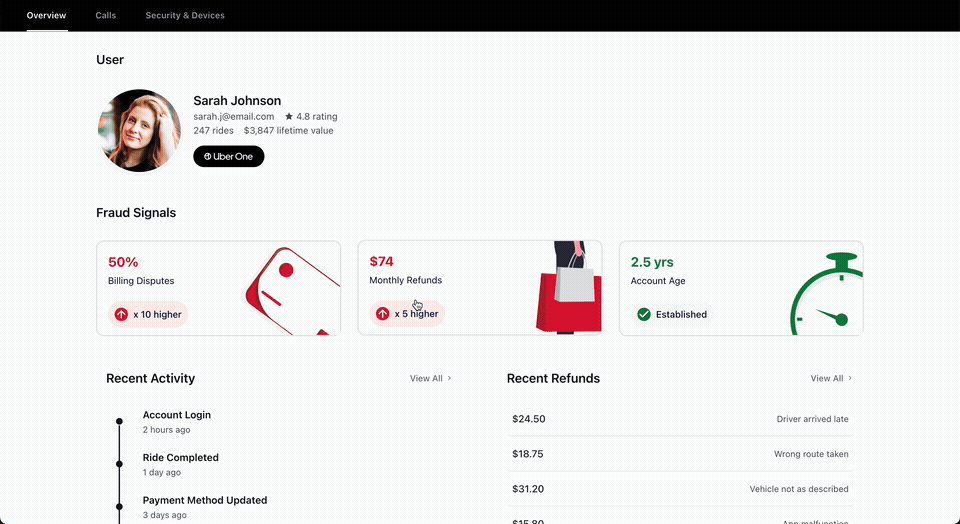
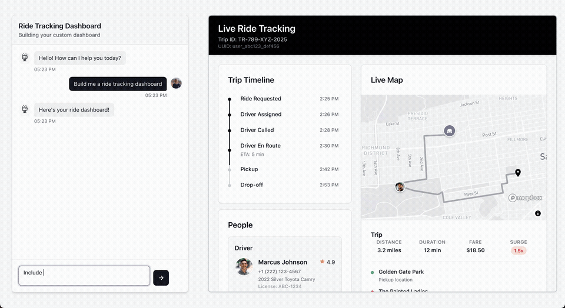
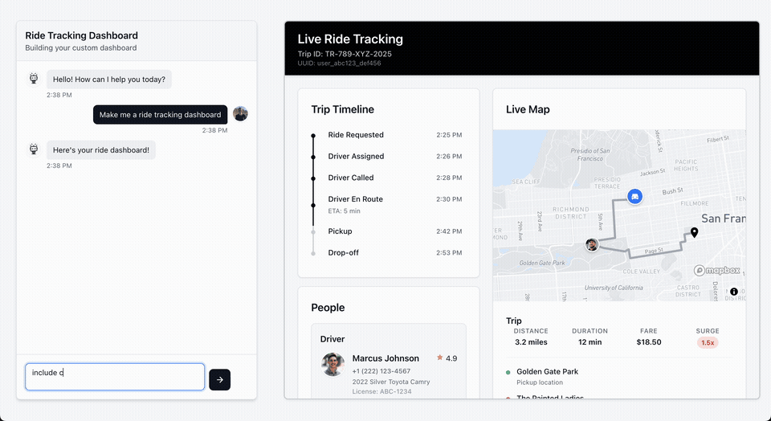

# Operative Demo - Call Fraud Dashboard

A React-based interactive dashboard application for analyzing call fraud patterns and customer support interactions. This project demonstrates advanced UI components with animations, chat interfaces, and data visualization capabilities.

## 🏗️ Get Started

Here are the components you'll want to swap in/out in the App.js file:

## Call Fraud Dashboard

#### 1. **ChatDemo4** (Main Entry Point)
Call Fraud dashboard is triggered by the first message in the chat.


#### 2. **CallFraudDashboard**
If you just want the Call Fraud Dashboard, no chat, then just use this component.



## Ride Tracking Dashboard

#### 3. **ChatDemo2**
Animation swapping in and out the components on second message.



#### 4. **ChatDemo3**
Skeleton overlay, triggered on second message.



## 🛠️ Technology Stack

- **React 18.2.0** - Component-based UI framework
- **Vite 5.0.8** - Fast build tool and development server
- **Framer Motion 12.16.0** - Advanced animation library
- **Chart.js 4.4.9** - Data visualization charts
- **React Map GL 8.0.4** - Interactive map components
- **React Icons 5.5.0** - Icon library

## 🚀 Getting Started

### Prerequisites

- Node.js (v14 or higher)
- npm or yarn package manager

### Installation

1. **Clone the repository**
   ```bash
   git clone <repository-url>
   cd new-ride-tracker
   ```

2. **Install dependencies**
   ```bash
   npm install
   ```

3. **Start development server**
   ```bash
   npm start
   # or
   npm run dev
   ```

4. **Open in browser**
   Navigate to [http://localhost:3000](http://localhost:3000)

## 📁 Project Structure

```
src/
├── components/
│   ├── ChatDemo2.js
│   ├── ChatDemo3.js
│   ├── ChatDemo4.js
│   └── CallFraudDashboard.js
├── assets/
│   ├── chatdemo4-preview.gif
│   ├── callfraud-dashboard-preview.gif
│   ├── chatdemo2-preview.gif
│   └── chatdemo3-preview.gif
├── App.js
└── index.js
```

## 🎯 Features

- Real-time chat interface with AI responses
- Interactive fraud detection dashboard
- Live ride tracking with map integration
- Smooth animations and transitions
- Responsive design for all screen sizes

## 📸 Adding Component Previews

To add preview GIFs for each component:

1. Create an `assets` folder in your project root
2. Record GIFs of each component in action
3. Save them with the following names:
   - `chatdemo4-preview.gif`
   - `callfraud-dashboard-preview.gif`
   - `chatdemo2-preview.gif`
   - `chatdemo3-preview.gif`
4. The GIFs will automatically display in the README